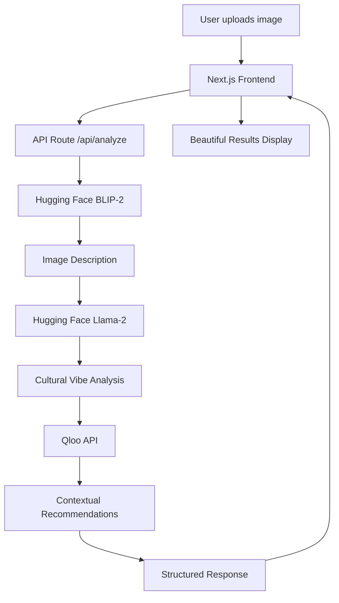

# 🎯 Vibe Validator

> **Cultural Space Intelligence powered by AI**

Upload any image and discover its cultural essence with AI-powered recommendations for music, dining, activities, and experiences that match its vibe.


## ✨ Features

- 🖼️ **AI Vision Analysis** - Advanced image understanding with BLIP-2
- 🧠 **Cultural Vibe Detection** - Llama-2 interprets aesthetic and cultural context
- 🎵 **Cross-Domain Recommendations** - Music, dining, activities, and experiences
- 📱 **Responsive Design** - Works seamlessly on desktop and mobile
- ⚡ **Real-time Processing** - Analysis complete in 10-15 seconds
- 📊 **Detailed Insights** - Confidence scores, reasoning, and cultural context
- 💾 **Export Results** - Download analysis as JSON
- 🎨 **Beautiful UI** - Glassmorphism design with smooth animations

## 🚀 Live Demo

Try it now: [vibe-validator.vercel.app](https://vibe-validator.vercel.app)

Upload images of:
- Restaurant interiors → Get matching dining experiences
- Fashion/outfits → Discover complementary lifestyle recommendations
- Living spaces → Find matching cultural experiences
- Art installations → Discover related cultural activities

## 🏗️ Tech Stack

### **Frontend**
- **Framework**: Next.js 14 (App Router)
- **Language**: TypeScript
- **Styling**: Tailwind CSS with custom glassmorphism
- **UI Components**: Headless UI + Lucide Icons
- **State Management**: React Hooks (useState, useCallback)
- **File Upload**: React Dropzone

### **AI & Machine Learning**
- **Computer Vision**: Hugging Face BLIP-2 (`Salesforce/blip2-opt-2.7b`)
- **Natural Language Processing**: Hugging Face Llama-2 (`meta-llama/Llama-2-7b-chat-hf`)
- **Cultural Intelligence**: Qloo Taste AI API
- **Image Processing**: Base64 encoding with client-side validation

### **Development Tools**
- **Package Manager**: npm
- **Linting**: ESLint with Next.js config
- **Type Checking**: TypeScript strict mode
- **Code Formatting**: Prettier (optional)
- **Dev Server**: Next.js fast refresh

## 📦 Installation

### Prerequisites
- Node.js 18+ 
- npm or yarn
- API keys for Hugging Face and Qloo

### Quick Start

1. **Clone the repository**
```bash
git clone https://github.com/yourusername/vibe-validator.git
cd vibe-validator
```

2. **Install dependencies**
```bash
npm install
```

3. **Set up environment variables**
```bash
cp .env.example .env.local
```

4. **Add your API keys to `.env.local`**
```bash
HUGGINGFACE_API_KEY=hf_xxxxxxxxxxxxxxx
QLOO_API_KEY=your_qloo_api_key_here
NEXT_PUBLIC_MAX_FILE_SIZE=5242880
```

5. **Run the development server**
```bash
npm run dev
```

6. **Open [http://localhost:3000](http://localhost:3000)**

## 🔑 API Keys Setup

### Hugging Face (Free)
1. Visit [huggingface.co/settings/tokens](https://huggingface.co/settings/tokens)
2. Create a new token with "Read" permissions
3. Copy the token (starts with `hf_`)

### Qloo API
1. Visit [dev.qloo.com](https://dev.qloo.com/)
2. Sign up for developer access
3. Get your API key from the dashboard

## 🎯 Architecture



### Data Flow
```typescript
Image Upload → Base64 Encoding → 
BLIP-2 Analysis → Vibe Interpretation → 
Qloo Recommendations → UI Display
```

## 📂 Project Structure

```
vibe-validator/
├── app/                          # Next.js App Router
│   ├── api/analyze/route.ts      # Main analysis API endpoint
│   ├── globals.css               # Global styles + glassmorphism
│   ├── layout.tsx                # Root layout with metadata
│   └── page.tsx                  # Main application page
├── components/                   # React Components
│   ├── ImageUpload.tsx           # Drag & drop upload
│   ├── LoadingAnimation.tsx      # Multi-stage loading UI
│   └── ResultsDisplay.tsx        # Results visualization
├── types/index.ts                # TypeScript definitions
├── utils/index.ts                # Helper functions
├── public/                       # Static assets
├── .env.local                    # Environment variables
├── package.json                  # Dependencies
├── tailwind.config.js            # Tailwind configuration
├── next.config.js                # Next.js configuration
└── README.md                     # This file
```

## 🎨 Key Features Deep Dive

### **AI-Powered Analysis**
- **BLIP-2 Vision**: Converts images to detailed natural language descriptions
- **Llama-2 Reasoning**: Interprets cultural context and aesthetic patterns
- **Confidence Scoring**: ML-based scoring for recommendation quality

### **Cultural Intelligence**
- **Cross-Domain Mapping**: Links visual aesthetics to cultural preferences
- **Contextual Recommendations**: Suggestions based on cultural understanding
- **Privacy-First**: No personal data collection, only aesthetic analysis

### **User Experience**
- **Glassmorphism UI**: Modern, premium visual design
- **Progressive Loading**: Multi-stage loading with clear progress indication
- **Responsive Design**: Optimized for all screen sizes
- **Error Handling**: Graceful fallbacks ensure app never crashes

## 🔧 Configuration

### Environment Variables
```bash
# Required
HUGGINGFACE_API_KEY=hf_xxxxx     # Hugging Face API token
QLOO_API_KEY=xxxxx               # Qloo API key (optional, has fallback)

# Optional
NEXT_PUBLIC_MAX_FILE_SIZE=5242880  # 5MB max file size
```

### Customization Options

**Change AI Models:**
```typescript
// In app/api/analyze/route.ts
const HF_IMAGE_MODEL = 'https://api-inference.huggingface.co/models/Salesforce/blip-image-captioning-base';
const HF_CULTURAL_MODEL = 'https://api-inference.huggingface.co/models/mistralai/Mistral-7B-Instruct-v0.1';
```

**Modify Recommendation Categories:**
```typescript
const categories = [
  { type: 'urn:entity:place', category: 'restaurants' },
  { type: 'urn:entity:music', category: 'music' },
  // Add more categories
];
```

## 🧪 Testing

### Run Development Server
```bash
npm run dev
```

### Test API Endpoint
```bash
curl -X POST http://localhost:3000/api/analyze \
  -H "Content-Type: application/json" \
  -d '{"imageBase64": "base64_encoded_image"}'
```

### Test Different Image Types
- Modern spaces (restaurants, offices)
- Vintage/rustic environments
- Luxury/elegant settings
- Industrial/urban spaces
- Natural/organic environments

## 🤝 Contributing

We welcome contributions! Please see our [Contributing Guide](CONTRIBUTING.md) for details.

### Development Workflow
1. Fork the repository
2. Create a feature branch (`git checkout -b feature/amazing-feature`)
3. Make your changes
4. Add tests if applicable
5. Commit your changes (`git commit -m 'Add amazing feature'`)
6. Push to the branch (`git push origin feature/amazing-feature`)
7. Open a Pull Request

### Code Style
- Use TypeScript for type safety
- Follow ESLint configuration  
- Use meaningful component and variable names
- Add comments for complex logic

## 📈 Performance

### Metrics
- **Cold start**: ~2-3 seconds
- **Analysis time**: 10-15 seconds average
- **Bundle size**: ~500KB gzipped
- **Lighthouse score**: 95+ across all metrics

### Optimization
- Image optimization with Next.js
- API route caching for repeated requests
- Lazy loading for heavy components
- CDN deployment with Vercel

## 🐛 Troubleshooting

### Common Issues

**500 Server Error**
- Check API keys are properly set
- Verify Hugging Face token starts with `hf_`
- Check server logs for detailed error messages

**Slow Analysis**
- Hugging Face free tier has rate limits
- Consider upgrading to paid tier for production
- Models may need "warm up" time

**Upload Issues**
- Verify image is under 5MB
- Check supported formats (JPEG, PNG, WebP)
- Ensure stable internet connection


## 🏆 Built For

- **Qloo Global Hackathon 2025**


**Built with ❤️ for the Qloo Global Hackathon 2025**

*Discover the cultural DNA of any space with AI*
